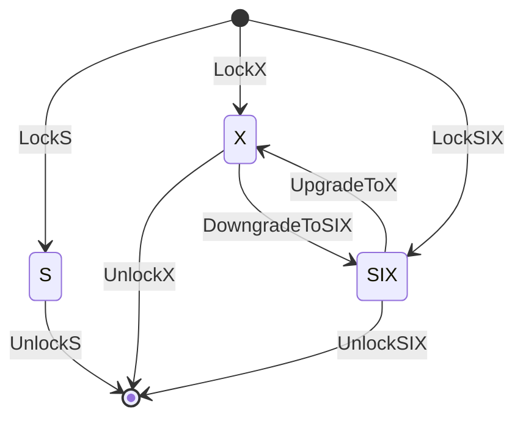

# `::dbgroup::lock`

## `PessimisticLock`

We implemented three types of locks: a shared lock (`S`), an exclusive lock (`X`), and a shared lock with an intent-exclusive lock (`SIX`). The following table summarizes conflicts between these locks. The check mark (`x`) indicates that there is no conflict between corresponding locks.

|| `S` | `SIX` | `X` |
|:-:|:-:|:-:|:-:|
| `S` | `x` | `x` | |
| `SIX` | `x` | | |
| `X` | | | |

In our implementation, we assume the following state transition of locks. Only one thread can get SIX/X locks and then upgrades/downgrades to X/SIX locks. Note that if any thread call `UpgradeToX` or `DowngradeToSIX` *without SIX/X locks*, it will corrupt an internal lock status.

The internal lock status is maintained as the following table. The first/second bits represent an exclusive lock and a shared lock with an intent-exclusive lock, respectively. If these bits are standing, it means any thread has acquired either X or SIX lock. The remaining bits maintain the number of threads that have acquired shared locks.

| 63-2 | 1 | 0 |
|:-:|:-:|:-:|
| a shared lock counter | an SIX-lock flag | an X-lock flag|
