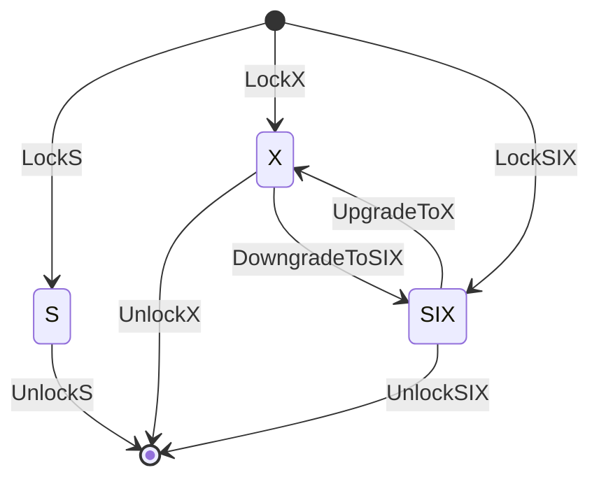

# `::dbgroup::lock`

## `PessimisticLock`

We implemented three types of locks: a shared lock (`S`), an exclusive lock (`X`), and a shared lock with an intent-exclusive lock (`SIX`). The following table summarizes conflicts between these locks. The check mark (`x`) indicates that there is no conflict between corresponding locks.

|| `S` | `SIX` | `X` |
|:-:|:-:|:-:|:-:|
| `S` | `x` | `x` | |
| `SIX` | `x` | | |
| `X` | | | |

In our implementation, we assume the following state transition of locks. Only one thread can get SIX/X locks and then upgrades/downgrades to X/SIX locks. Note that if any thread call `UpgradeToX` or `DowngradeToSIX` *without SIX/X locks*, it will corrupt an internal lock status.



The internal lock status is maintained as the following table. The first/second bits represent an exclusive lock and a shared lock with an intent-exclusive lock, respectively. If these bits are standing, it means any thread has acquired either X or SIX lock. The remaining bits maintain the number of threads that have acquired shared locks.

| 63-2 | 1 | 0 |
|:-:|:-:|:-:|
| a shared lock counter | an SIX-lock flag | an X-lock flag|

## `OptimisticLock`

In our implementation, we use a *version-check* functionality for optimistic locking. You can get a version value via `GetVersion` and check its validity by `HasSameVersion`. The following code is a short example of version-based retries.

```cpp
while(true) {
  // keep a current version value
  const auto ver = opt_lock_.GetVersion();

  // ...some codes for reading shared region...

  if (opt_lock_.HasSameVersion(ver)) break;
  // version check failed, so retry from getting a version value
}
```

Our optimistic lock implementation has the same locks as `PessimisticLock`, and so you can use shared/exclusive/shared-intent-exclusive locks with version-based concurrency controls. Note that only `UnlockX` and `DowngradeToSIX` functions increment version values.

The internal lock status is maintained as the following table. The lowest sixteen bits represent the number of threads that have acquired shared locks. The following two bits represent a shared lock with an intent-exclusive lock and an exclusive lock, respectively. If these bits are standing, it means any thread has acquired either X or SIX lock. The remaining bits maintain a current version value.

| 63-18 | 17 | 16 | 15-0 |
|:-:|:-:|:-:|:-:|
| a version value | an X-lock flag | an SIX-lock flag | a shared lock counter |
