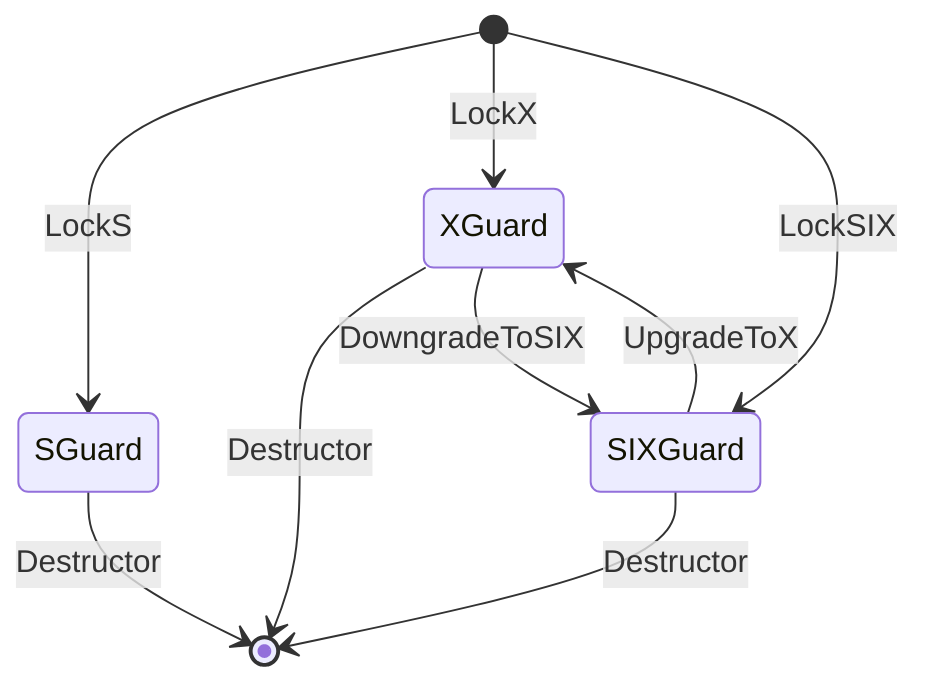
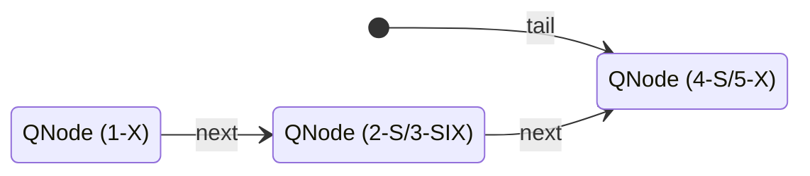
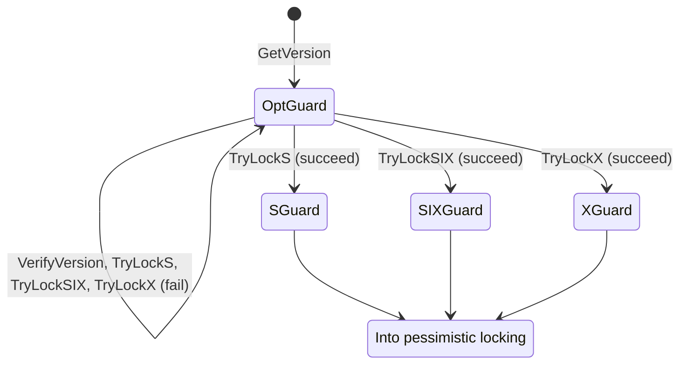

# `::dbgroup::lock`

- [Pessimistic Locking](#pessimistic-locking)
    - [class PessimisticLock](#class-pessimisticlock)
    - [class MCSLock](#class-mcslock)
    - [Example of Usages](#example-of-usages)
- [Optimistic Locking](#optimistic-locking)
    - [class OptimisticLock](#class-optimisticlock)
    - [Example of Usages](#example-of-usages-1)

## Pessimistic Locking

We have implemented three types of locks: a shared lock (`S`), an exclusive lock (`X`), and a shared-with-intent-exclusive lock (`SIX`). The following table summarizes the compatibility between these locks. The check mark (`x`) indicates that there is no conflict between the corresponding locks.

|       |  `S`  | `SIX` |  `X`  |
| :---: | :---: | :---: | :---: |
|  `S`  |  `x`  |  `x`  |       |
| `SIX` |  `x`  |       |       |
|  `X`  |       |       |       |

In our implementation, we assume the following state transition of locks. Since we apply the scoped locking pattern to our lock classes, each function returns the corresponding lock guard instance (`SGuard`, `SIXGuard`, and `XGuard`). In their destructions, they release the holding locks.



### class PessimisticLock

We maintain the internal lock state according to the following table. The last and second-to-last bits represent exclusive and shared-with-intent-exclusive locks, respectively. When these bits are set, a thread has acquired either X or SIX locks. The remaining bits maintain the number of threads that have acquired shared locks.

|       63       |        62        |         61-0          |
| :------------: | :--------------: | :-------------------: |
| an X lock flag | an SIX lock flag | a shared lock counter |

### class MCSLock

We have implemented the MCS queue lock [^1] with shared and shared-with-intent-exclusive locks. We maintain the internal lock state according to the following table. The last and second-to-last bits represent exclusive and shared-with-intent-exclusive locks, respectively. The following 15 bits preserve the number of threads that have acquired shared locks. The remaining bits contain the pointer of an MCS queue node.

|       63       |        62        |         61-47         |         46-0         |
| :------------: | :--------------: | :-------------------: | :------------------: |
| an X lock flag | an SIX lock flag | a shared lock counter | a queue node pointer |

Our MCS lock allows shared and shared-with-intent-exclusive locks, but note that *a queue orders their lock acquisitions*. For example, assume that five threads request locks to our MCS lock in the following order.

1. Thread 1: An exclusive lock.
2. Thread 2: A shared lock.
3. Thread 3: A shared-with-intent-exclusive lock.
4. Thread 4: A shared lock.
5. Thread 5: An exclusive lock.

These requests finally construct the following lock queue. Since Thread 1 holds the exclusive lock, Threads 2 and 3 need to wait for Thread 1. After Thread 1 releases its lock, Threads 2 and 3 can acquire their locks simultaneously because S/SIX locks coexist. Thread 4 also requests a shared lock, but *the queue order refuses this request and forces Thread 4 to wait*. After Threads 2 and 3 release their locks, Thread 4 can obtain the lock, and Thread 5 waits for it to release its lock.



### Example of Usages

```cpp
// C++ standard libraries
#include <iostream>
#include <thread>
#include <vector>

// our libraries
#include "dbgroup/lock/pessimistic_lock.hpp"

auto
main(  //
    const int argc,
    const char *argv[])  //
    -> int
{
  // create a global lock and counter
  ::dbgroup::lock::PessimisticLock lock{};
  size_t count{0};

  // create and run workers
  std::vector<std::thread> threads{};
  for (size_t i = 0; i < 8; ++i) {
    threads.emplace_back([&]() {
      // increment the counter with an exclusive lock
      for (size_t loop = 0; loop < 10000; ++loop) {
        const auto &x_guard = lock.LockX();
        ++count;
      }
    });
  }

  // wait for the workers
  for (auto &&t : threads) {
    t.join();
  }

  {  // check the counter
    const auto &s_guard = lock.LockS();
    std::cout << count << std::endl;
  }
  return 0;
}
```

## Optimistic Locking

We use a *version-check* functionality for optimistic locking. You can get a version value with `GetVersion` and check its validity with `VerifyVersion`. Our optimistic lock implementation has the same locks as pessimistic locking, and so you can use shared/exclusive/shared-with-intent-exclusive locks with version-based concurrency controls. We also prepare `TryLock` functions to acquire locks with the version check.

The following state diagram shows how our lock guards and functions work. Note that each function directly modifies the version state in `OptGuard` if the version verification fails. `XGuard`'s destructor and `DowngradeToSIX` function modify the version of a target lock. Our implementation increments a version by one as default, but you can set a desired version value using `XGuard::SetVersion` function.



We have implemented an optimistic/shared composite lock guard as one variant of optimistic locking. `PrepareRead` function first tries reading a valid version value for optimistic locking. If another thread holds an exclusive lock, `PrepareRead` switches to acquire a shared lock to avoid repeated fails of version verification. We emphasize that only a single thread will obtain a shared lock if multiple threads perform `PrepareRead`. The other threads can use the version-based optimistic read while the thread holds the shared lock.

### class OptimisticLock

We maintain the internal lock state according to the following table. The last and second-to-last bits represent exclusive and shared-with-intent-exclusive locks, respectively. The following 30 bits preserve the number of threads that have acquired shared locks. The remaining bits contain the current version value.

|       63       |        62        |         61-32         |      31-0       |
| :------------: | :--------------: | :-------------------: | :-------------: |
| an X lock flag | an SIX lock flag | a shared lock counter | a version value |

### Example of Usages

#### Optimistic Read Procedure

```cpp
for (auto &&opt_guard = opt_lock.GetVersion();;) {  // keep a version-based guard
  // you can use `PrepareRead` to use an optimistic/shared composite lock guard

  // ...some codes for reading a shared region...

  if (opt_guard.VerifyVersion()) break;
  // the version check failed, so retry

  // you can check the new version and apply additional controls
  const uint32_t ver = opt_guard.GetVersion();
  // ...
}
```

#### Acquiring Locks with Version Verification

```cpp
for (auto &&opt_guard = opt_lock.GetVersion();;) {  // keep a version-based guard
  // ...some codes for reading a shared region...

  if (const auto &x_guard = opt_guard.TryLockX(); x_guard) {
    // the exclusive lock has been acquired
    // ...
    break;
  }
  // the version check failed, so retry
}
```

#### Controling Internal Version State

```cpp
{
  auto &&x_guard = opt_lock.LockX();

  // ...some codes for modifying a shared region...

  // increment a version by 2
  x_guard.SetVersion(x_guard.GetVersion() + 2);
}
```

[^1]: M. Herlihy et al., “The art of multiprocessor programming,” chapter 7, Morgan Kaufmann, 2nd edition, 2021.
