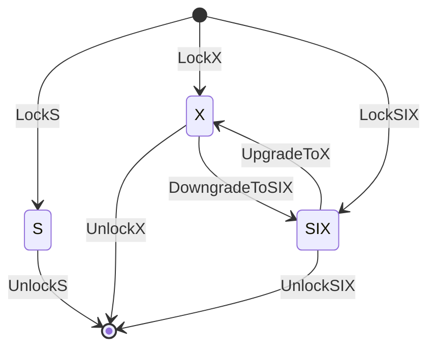

# `::dbgroup::lock`

## `PessimisticLock`

We have implemented three types of locks: a shared lock (`S`), an exclusive lock (`X`), and a shared-with-intent-exclusive lock (`SIX`). The following table summarizes the compatibility between these locks. The check mark (`x`) indicates that there is no conflict between the corresponding locks.

|| `S` | `SIX` | `X` |
|:-:|:-:|:-:|:-:|
| `S` | `x` | `x` | |
| `SIX` | `x` | | |
| `X` | | | |

In our implementation, we assume the following state transition of locks. Only one thread can get SIX/X locks and then upgrade/downgrade to X/SIX locks. Note that if a thread calls `UpgradeToX` or `DowngradeToSIX` *without SIX/X locks*, it will corrupt an internal lock state.



We maintain the internal lock state according to the following table. The first/second bits represent an exclusive lock and a shared-with-intent-exclusive lock, respectively. When these bits are set, a thread has acquired either X or SIX locks. The remaining bits maintain the number of threads that have acquired shared locks.

| 63 | 62 | 61-0 |
|:-:|:-:|:-:|
| an X lock flag | an SIX lock flag | a shared lock counter |

### Usage Example

```cpp
// C++ standard libraries
#include <iostream>
#include <thread>
#include <vector>

// our libraries
#include "lock/pessimistic_lock.hpp"

auto
main(  //
    const int argc,
    const char *argv[])  //
    -> int
{
  // create a global lock and counter
  ::dbgroup::lock::PessimisticLock lock{};
  size_t count{0};

  // prepare a sample worker procedure
  auto worker = [&]() {
    for (size_t loop = 0; loop < 10000; ++loop) {
      lock.LockX();
      ++count;
      lock.UnlockX();
    }
  };

  // create and run workers
  std::vector<std::thread> threads{};
  for (size_t i = 0; i < 8; ++i) {
    threads.emplace_back(worker);
  }

  // wait for the workers
  for (auto &&t : threads) {
    t.join();
  }

  // check the counter
  lock.LockS();
  std::cout << count << std::endl;
  lock.UnlockS();

  return 0;
}
```

## `OptimisticLock`

In our implementation, we use a *version-check* functionality for optimistic locking. You can get a version value with `GetVersion` and check its validity with `HasSameVersion`. The following code is a quick example of version-based retries.

```cpp
while(true) {
  // keep a current version value
  const auto ver = opt_lock_.GetVersion();

  // ...some codes for reading shared region...

  if (opt_lock_.HasSameVersion(ver)) break;
  // version check failed, so retry from getting a version value
}
```

Our optimistic lock implementation has the same locks as `PessimisticLock`, and so you can use shared/exclusive/shared-intent-exclusive locks with version-based concurrency controls. Note that only `UnlockX` and `DowngradeToSIX` functions increment version values.

We maintain the internal lock state according to the following table. The bottom sixteen bits represent the number of threads that have acquired shared locks. The next two bits represent shared-with-intent-exclusive and exclusive locks, respectively. When one of these bits is set, it means that a thread has acquired the corresponding lock. The remaining bits retain a current version value.

| 63-18 | 17 | 16 | 15-0 |
|:-:|:-:|:-:|:-:|
| a version value | an X lock flag | an SIX lock flag | a shared lock counter |
