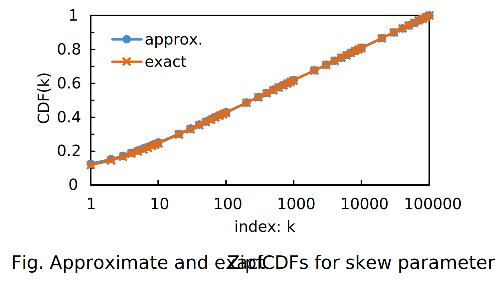

# `::dbgroup::random`

- [ZipfDistribution](#zipfdistribution)
- [ApproxZipfDistribution](#approxzipfdistribution)
    - [Example of Usages](#example-of-usages)

## ZipfDistribution

This class generates random values according to Zipf's law. This class can accurately simulate the Zipf distribution, but it may take some time to construct an accurate cumulative distribution function.

Note that a template `IntType` must be 32/64-bit integers, such as `size_t` and `int64_t`.

## ApproxZipfDistribution

This class approximates the Zipf distribution using Chlebus's approximation formula for a partial sum of the divergent p-series[^1]. Note that this approximation works well when the following conditions are satisfied:

1. a distribution has sufficient bins (100,000 or more recommended) and
2. a skewness parameter is in [0, 1].

Thus, we compute exact CDFs with $k < 100$ and use them for the corresponding queries. If the condition $k \geq 100$ is satisfied, we use Chlebus's approximation formula.

The following figure shows the comparison between approximate and exact CDFs.



Note that a template `IntType` must be 32/64-bit integers, such as `size_t` and `int64_t`.

### Example of Usages

```cpp
// C++ standard libraries
#include <iostream>

// our libraries
#include "random/zipf.hpp"

auto
main(  //
    const int argc,
    const char *argv[])  //
    -> int
{
  constexpr size_t kMin = 0;
  constexpr size_t kMax = 1000;
  constexpr double skew = 1.0;

  // create a Zipf distribution and a random number generator
  ::dbgroup::random::ApproxZipfDistribution zipf{kMin, kMax, skew};
  std::mt19937_64 rand_engine{std::random_device{}()};

  // get samples according to the Zipf distribution
  for (size_t i = 0; i < 30; ++i) {
    std::cout << zipf(rand_engine) << std::endl;
  }

  return 0;
}
```

The above example outputs thirty random values according to the Zipf distribution as follows.

```txt
45
430
2
36
2
55
11
108
201
462
42
45
100
73
0
49
10
1
0
509
0
0
90
11
32
10
36
208
6
0
```

[^1]: [Edward Chlebus, "An approximate formula for a partial sum of the divergent p-series," Applied Mathematics Letters, Vol. 22, No. 5, pp. 732-737, 2009.](https://doi.org/10.1016/j.aml.2008.07.007)
