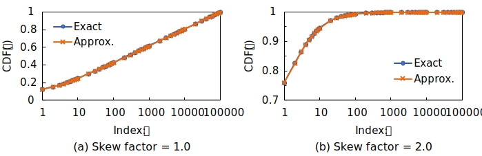

# `::dbgroup::random`

## `ZipfDistribution<IntType>`

This class generates random values according to Zipf's law. This class can simulate exact the Zipf distribution, but it may take some time to construct an accurate cumulative distribution function.

## `ApproxZipfDistribution<IntType>`

This class approximates the Zipf distribution by using Chlebus's approximate formula for a partial sum of the divergent p-serires[^1]. Note that this approximation works well when the following conditions are satisfied:

1. a distribution has the sufficient number of bins (100,000 or more recommended) and
2. a skew parameter is in [0, 1].

For example, the maximum error of CDFs between `ApproxZipfDistribution<IntType> approx{0, 100000, 1.0}` and `ZipfDistribution<IntType> exact{0, 100000, 1.0}` is about 0.01. The following figure shows the comparison between approximate and exact CDFs.

[^1]: [Edward Chlebus, "An approximate formula for a partial sum of the divergent p-series," Applied Mathematics Letters, Vol. 22, No. 5, pp. 732-737, 2009.](https://doi.org/10.1016/j.aml.2008.07.007)
